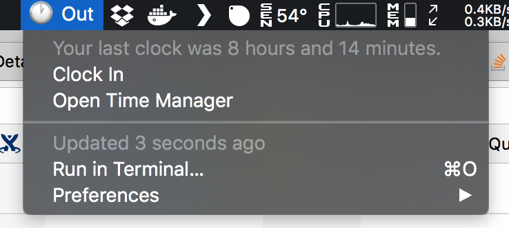

# Bitbar Plugins
This is my repository for my [BitBar](https://github.com/matryer/bitbar) plugins.

## Installation
1. Install [BitBar](https://github.com/matryer/bitbar).
2. Clone this repository to some where safe: `git clone https://github.com/adriancooney/bitbar-plugins.git`
3. Make `plugins/` your plugin directory or add symbolically link the scripts inside you BitBar plugin directory (you need to symlink them for the `config.json`).
4. Rename the `config.example.json` to `config.json` and update the details.
5. Chmod all the scripts to allow them to be executable: `chmod +x plugins/*.sh`

## Plugins
### Teamwork Clock
A simple clock in/clock out for Teamwork.

* Shows you in the taskbar whether you are clocked in or out.
* Allows you to clock in or out.
* Quick link to the online time manager.
* Shows a `⚠️` if you haven't clocked in/out within an hour of your target times (see `config.json`).
* Updates every 30 seconds.

The clock manager requires `jq` and `curl`, both can be installed with `brew`:

    $ brew install jq curl